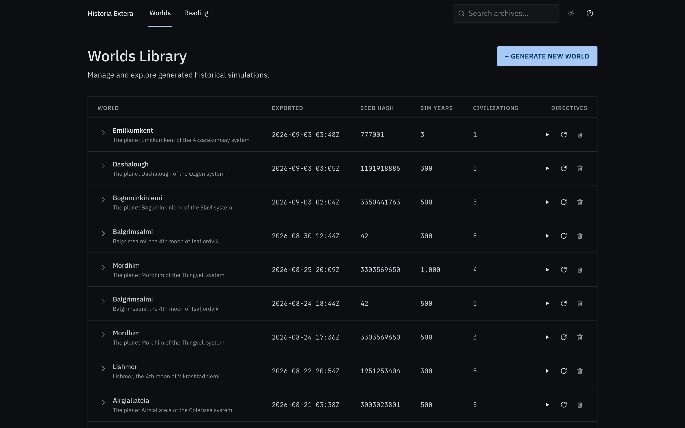
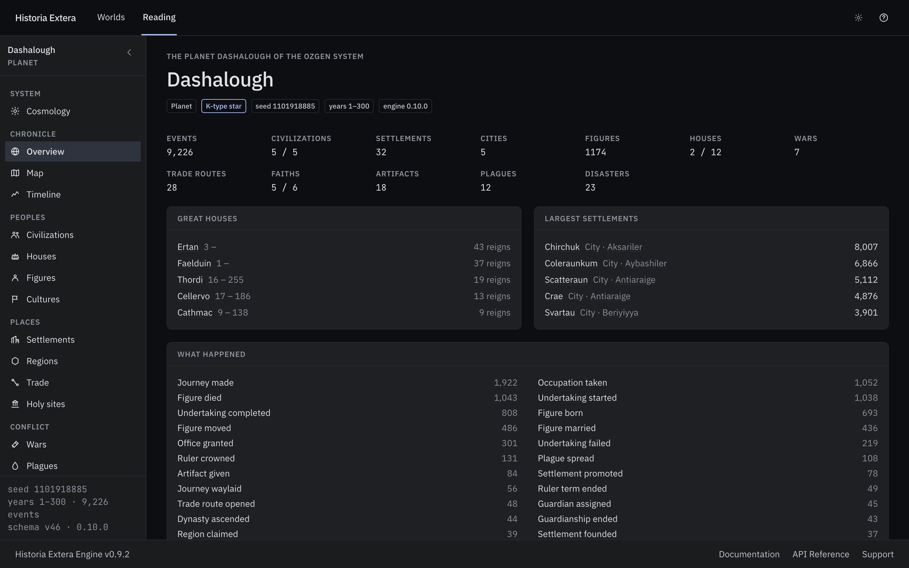
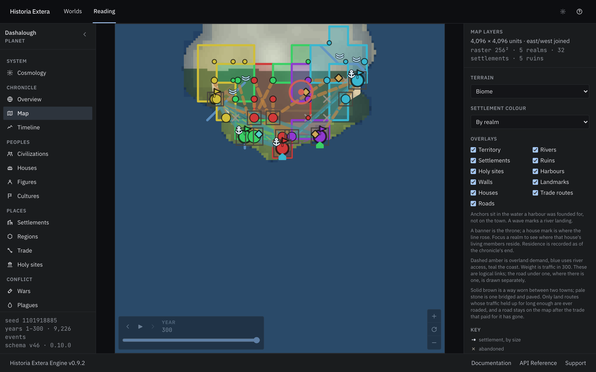
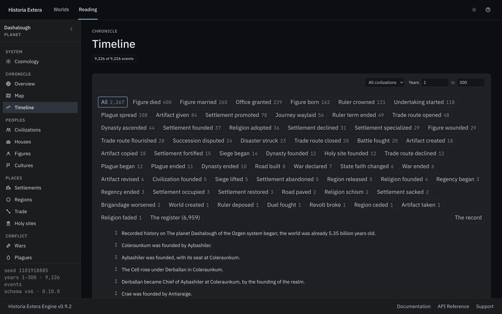
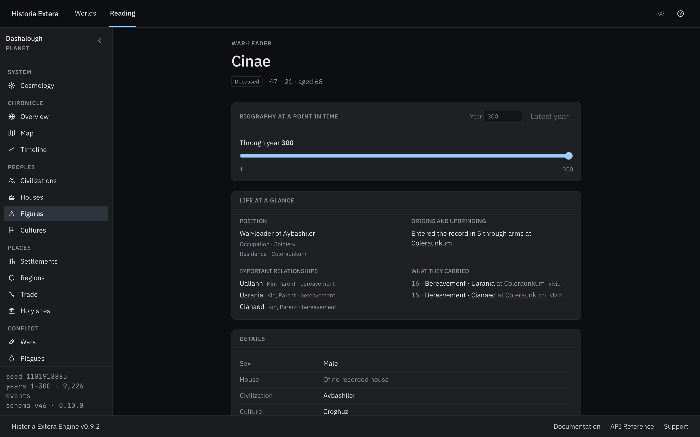
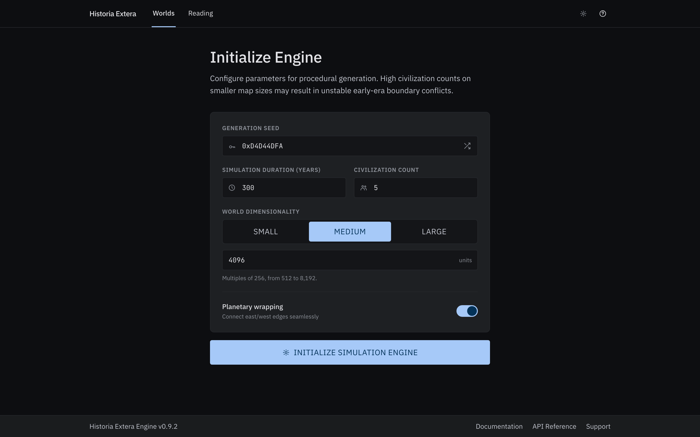

# Historia Extera

A deterministic world-history generator. Give it a seed and it builds centuries of
settlements, peoples, rulers, faiths, wars, trade, plagues, disasters and artifacts —
then hands you a finished history to read.

Same seed, same history. Every time.


## What it makes

Not a strategy game you play, and not a random name generator. It runs a world forward
year by year and records what happened, so the shape of the world is legible afterwards:
why a city grew, how a dynasty held on, what moved a border, which routes carried trade
and disease, and why a realm disappeared.

A finished world contains:

- **A world.** Terrain, rivers, biomes and coasts — and the local system it sits in: the
  planet or moon it is, its moons, its giants and comets, and the galaxy around it.
- **Realms and settlements.** Founding, promotion, decline and abandonment; what each
  town is known for; harbours, walls, mines and passes; what feeds it and what the roads
  bring.
- **People.** Figures who belong to houses, hold offices, follow faiths, marry, inherit
  and die — of plague, disaster, poison or old age. They carry bonds, formative memories,
  wounds, quarrels, plots and undertakings, so a life reads as cause and consequence
  rather than a list of dates.
- **Faiths.** Gods, church forms, clergy and observance; schisms, holy sites and
  pilgrimages.
- **Wars.** Campaigns, battles and sieges — carried by storm, relieved, lifted, or still
  invested — with the commanders who stood in them.
- **Trade.** Routes that open and close, and the roads that the busiest of them earned.
- **Plagues and disasters.** Named outbreaks that travel the routes, and the calamities
  that took named people with them.

## Reading a world

Histories open in the viewer — the native macOS app, or the same thing in a browser.

**The library** lists every world you have generated: seed, years, civilizations, size,
a biome map, and how it all ended. Open one, run the same seed again for more years, or
delete it.



**The overview** is the world at a glance — how many settlements, figures, houses, wars,
faiths, plagues and disasters it produced, its great houses by reigns held, its largest
cities, and a tally of everything that happened.



**The map** is drawn for a year, not just for the end. Pull the year slider and borders
move, towns appear and grow, battles mark the year they were fought. Colour the dots by
realm or by faith — two political maps of the same world, disagreeing in the interesting
places. Overlays for trade routes, roads, harbours, houses, walls, holy sites and
landmarks sit on the same year, and the year's chronicle sits beside it.



**Everything is a link.** Realm → house → ruler → war → battle → city → trade route →
region → faith → holy site → artifact. Lists filter by what you would actually ask for:
cities known for mining, faiths that were forgotten, figures who died of plague.

**The timeline** is the whole chronicle, filterable by kind and by year — every death,
marriage, crowning, siege, schism and waylaid journey the world recorded.



**A person's page** is a biography, not a data dump: their position, upbringing,
relationships, formative memories, wounds and open concerns. Set it to an earlier year
and it becomes a contemporary account — later revelations vanish. The raw event ledger is
one click away when you want the facts behind the prose.



## Running it

### The macOS app

The app is self-contained — it carries its own engine and runtime, so nothing else needs
to be installed. Build it once from a checkout:

```bash
make macos-release
```

That writes a `.dmg` and a `.zip` (with checksums) to `build/release/`. Mount the disk
image, drag **Historia Extera** to Applications, and open it. Worlds you generate are kept
outside the app, in `~/Library/Application Support/Historia Extera/Worlds`, so they survive
reinstalling it.

The build is ad-hoc signed rather than notarized, so the first launch needs the usual
right-click → **Open**.

### In a browser

The same viewer runs on the desktop, from a checkout with the .NET 10 SDK and Node 22.12+
installed:

```bash
make install     # once
make viewer
```

Open the URL Astro prints — usually `http://localhost:4321` — and you land in the Worlds
Library. To generate a world without the interface:

```bash
make generate SEED=7 YEARS=500 CIVS=12
```

The export lands in `viewer/public/worlds/` and shows up in the library. Full build, test
and packaging instructions are in [CONTRIBUTING.md](CONTRIBUTING.md).

## Making a world

**Generate new world** asks for the few knobs that matter:

| Knob | What it changes |
|---|---|
| Seed | The world. Everything else follows from it. |
| Years | How much history to simulate. |
| Civilizations | How many peoples start out. |
| World size | Small, medium, large, or an exact size — and whether it wraps east to west. |

The run shows its progress and the engine's own summary as it arrives, which is what
answers "was that seed worth looking at". You can abort a run in flight. Each finished run
is saved under its own name, so an earlier, shorter history of the same seed stays on disk.



A world is worth what its seed is worth: the same seed, years and size always rebuild the
same history, so a seed is the whole world in one number — short enough to write down and
hand to somebody else.

## Docs

- [Getting started](docs/guide/getting-started.md)
- [CLI](docs/guide/cli.md)
- [Viewer](docs/guide/viewer.md)
- [DESIGN.md](DESIGN.md) — how the world is built, and why

## License and packaged app

Historia Extera is licensed under the **GNU Affero General Public License, version 3
only** (`AGPL-3.0-only`). See [LICENSE](LICENSE) for the full terms.

The source may be used for any purpose, including commercial use, under the AGPL. If
you distribute a modified version, or let users interact with one over a network, the
AGPL requires you to offer its corresponding source under the same license.

An individual purchase covers the packaged macOS app and updates released during the
update period stated at purchase. When that period ends, you may keep using every
version you received; renewing is needed only for later updates. Buying the packaged
app does not change or restrict the rights granted by the AGPL.

Third-party dependencies retain their own licenses. The name corpora retain their
[CC0 1.0 dedication](src/HistoryEngine/Naming/Corpora/LICENSES.md).
